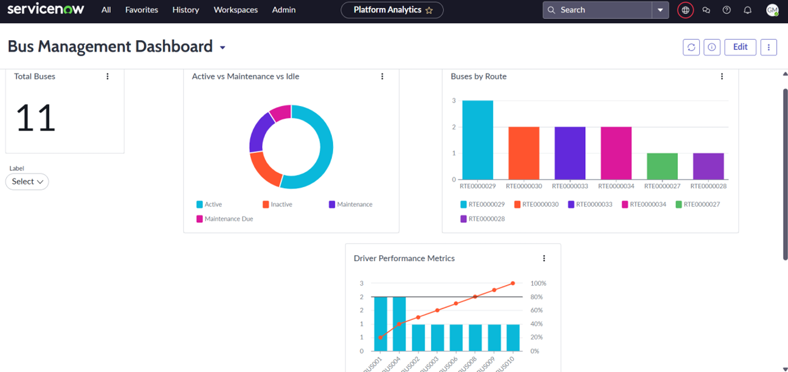
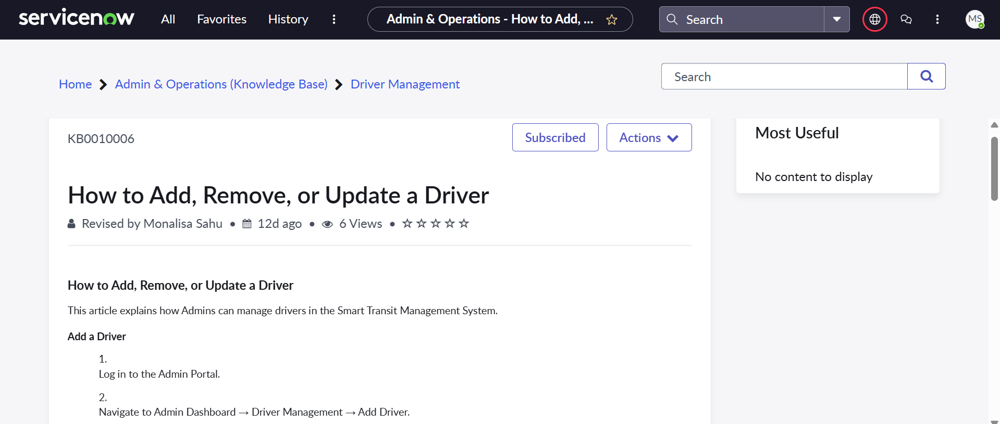
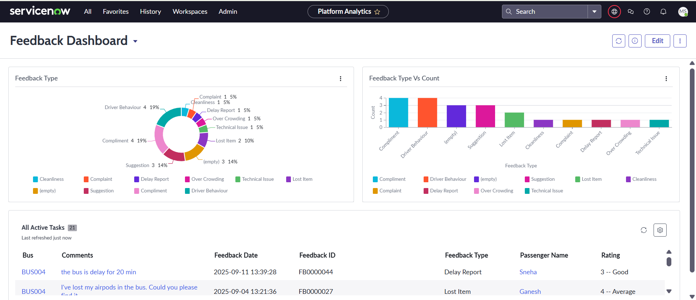

# 🚍 Smart Transport Management System (ServiceNow)

---

## 📌 Project Summary
The **Smart Transport Management System (STMS)** is a ServiceNow-based solution designed to **streamline and automate bus transit operations**. It provides an integrated platform to manage passengers, drivers, buses, schedules, and payments efficiently.  

Key capabilities include:  
* **Passengers:** Book/manage tickets, provide feedback, and make payments.  
* **Drivers:** Access assignments, schedules, and route details.  
* **Administrators:** Monitor buses, manage routes, generate reports, and oversee operations.  

All functionality is packaged in a **ServiceNow Update Set (`update_set.xml`)** for easy deployment.

---

## 🛠️ Skills & Tools
* **ServiceNow Platform:** Tables, Forms, Lists, Studio, Flow Designer, Business Rules (with scripting for automation), Notifications, Catalog Items, Reporting, Dashboards, Knowledge Base  
* **Soft Skills:** Requirement Analysis, Problem Solving, Documentation, Team Collaboration  

---

## 📂 Implemented Tables
The system utilizes custom tables to organize transit data:  
* **Passenger** – Tracks passenger information and registration  
* **Driver** – Stores driver details and assignments  
* **Bus** – Records bus information and operational status  
* **Bookings** – Maintains seat reservation records  
* **Tickets** – Tracks ticket status (Booked, Completed, Cancelled)  
* **Payments** – Logs payment details with auto-generated IDs  
* **Feedback** – Captures passenger reviews and ratings  
* **Schedule** – Maintains bus timings and availability  
* **Route** – Defines start, end, and intermediate stops  
* **GPS Tracking** – Shows real-time bus location  
* **Prices** – Stores fare details between points  

---

## ⚙️ Workflows & Automation
STMS includes automated flows and business rules to streamline operations:  
* **Auto ID Generation:** Assigns Bus ID, Booking ID, Payment ID, etc. automatically  
* **Passenger Registration Flow:** Creates a passenger record and sends confirmation emails  
* **Feedback Flow:** Sends notifications to admins when new feedback is submitted  
* **Booking Flow:** Updates booking statuses automatically  
* **Payment Processing Flow:** Validates transactions and updates ticket statuses  
* **Ticket & Schedule Management:** Completes expired tickets and validates schedules automatically  
* **Reporting Flow:** Generates daily operational reports and emails them to administrators  

---

## 📊 Dashboards
Interactive dashboards provide insights into:  
* **Bus Operations:** Active vs maintenance buses, buses by route, driver performance metrics  
* **Passenger Feedback:** Ratings and comments distribution  
* **Payments:** Transaction summaries, revenue by day, payment methods used  
* **Routes:** Usage analytics and performance monitoring  

---

## 📑 Service Catalog
STMS offers several service catalog items to enhance passenger experience:  
* **Book a Ticket** – Reserve seats on scheduled buses  
* **Cancel a Ticket** – Submit cancellation requests  
* **Bus Maintenance Request** – Request bus repair or maintenance  
* **Report Lost Item** – Report any lost belongings during travel  
* **Request Refund** – Submit financial service requests  

---

## 📖 Knowledge Base
A structured knowledge base is available for support:  
* **Admin & Operations:** Guidelines on route setup, driver management, and reporting  
* **Driver Support:** Instructions for viewing assignments  
* **Passenger Support:** Guides for booking tickets  

---
## Screenshots

### 1. Bus Management Dashboard

### 2. Driver Management Knowledge Base

### 3. Driver Table

### 4. Feedback Dashboard

---

## 🚀 Deployment Instructions
To deploy the system in your ServiceNow instance:  
1. Navigate to **System Update Sets → Retrieved Update Sets**  
2. Click **Import Update Set from XML**  
3. Upload the `update_set.xml` file  
4. Preview the changes  
5. Commit the update set to apply all configurations  

---

## 📂 Repository Structure

**Smart-Transport-Management-System/**

* **Documents/** # Project documents and reports
  - Smart_Transport_Management_System.pdf
  - Smart_Transport_Management_System.pptx

* **Screenshots/** # Screenshots and images for dashboards, tables, KB, etc.
  - Bus Management Dashboard.png
  - Driver Management KB.png
  - Driver Table.png
  - Feedback Dashboard.png
  - Knowledge_Base.png
  - ServiceNow_Logo.jpg
  - UI_page.png

* `update_set.xml` # ServiceNow Update Set for deployment

* `README.md` # Project overview and instructions

---

